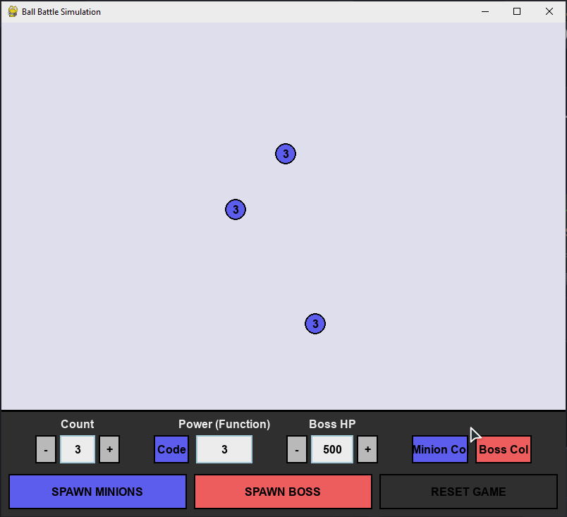

# Ball Battle Simulation

A customizable physics-based battle simulation where you spawn "Minion" balls to defeat "Boss" balls. Built with Python and Pygame.



## Features

*   **Physics Engine**: Real-time elastic collision simulation with wall bouncing.
*   **Interactive Control Panel**: Adjust game parameters on the fly without restarting.
*   **Resizable Window**: The game interface and physics boundaries adapt dynamically to any window size.
*   **Customizable Entities**:
    *   Set spawn count and power for Minions.
    *   Set custom Health Points (HP) for Bosses.
    *   Customize colors (Cycle presets or randomize).
*   **Advanced Scripting**: Use the built-in **Python Script Editor** to define custom damage logic for Minions as they level up.
*   **Boss Logic**: Spawn multiple bosses. The simulation runs until the last boss is defeated.
*   **Robustness**: Global exception handling prevents crashes, and UI elements resize and reflow dynamically to prevent overlapping.

## Prerequisites

*   Python 3.8+
*   Pygame 2 (installed from `requirements.txt`)

## Installation and running

```bash
git clone https://github.com/naniiic137/ball_simulation.git
cd ball_simulation

python -m venv .venv
# Windows: .venv\Scripts\activate    macOS/Linux: source .venv/bin/activate
pip install -r requirements.txt

python ball_simulation.py
```

## Controls & Usage

The control panel is located at the bottom of the window.

### 1. Configuration
*   **Count**: Determines how many Minions spawn when you click "SPAWN MINIONS".
    *   Use `+` / `-` buttons or type directly in the box.
*   **Power**: Determines the damage a Minion deals to a Boss.
    *   **Basic**: Type a number (e.g., `5`).
    *   **Math**: Type a Python expression (e.g., `random.randint(1, 10)` or `math.pi`).
    *   **Code**: Click the **Code** button to open the Script Editor (see below).
*   **Boss HP**: Sets the starting health for new Bosses. Supports math expressions (e.g., `10**5` or `10**10**2`). **Warning:** Extremely large numbers (like `10**10**100`) may freeze the game.
*   **Colors**:
    *   **Left-Click**: Cycle through a preset palette.
    *   **Right-Click**: Pick a completely random color.

### 2. Actions
*   **SPAWN MINIONS**: Spawns the set number of small balls (Minions) at random locations.
*   **SPAWN BOSS**: Spawns a large ball (Boss) in the center.
*   **RESET GAME**: Clears all balls and resets the game state.

### 3. The Script Editor (Advanced Power)

Click the **Code** button to open the in-game Python editor. This allows you to define how Minion power evolves over time.

**Rules:**
*   You must define a function named `def power(level):`.
*   It must return an integer.
*   `level` starts at 1 and increases by 1 every time a Minion hits a Boss.

**Example Script:**
```python
def power(level):
    # Damage increases exponentially with every hit
    return level ** 2
```

**Editor Controls:**
*   **Type**: Write standard Python code.
*   **Tab**: Indent code (4 spaces).
*   **Save**: Apply the script. If there is a syntax error, it will be displayed at the bottom of the editor.
*   **Close**: Discard changes or close the window.

> **Security note:** the Power box and the Script Editor run your text with Python's `eval`/`exec`.
> This is meant for experimenting on your own machine and is **not a sandbox**: only paste code you
> trust, the same as running any Python script.

## Game Mechanics

1.  **Spawning**: You can spawn multiple Bosses and waves of Minions.
2.  **Combat**:
    *   When a Minion hits a Boss, the Boss takes damage equal to the Minion's current `value`.
    *   The Minion then **Levels Up** (Level + 1).
    *   The Minion's new damage `value` is recalculated based on your Power setting or Custom Script.
3.  **Victory**:
    *   When a Boss reaches 0 HP, it is immediately removed from the screen.
    *   When **all** Bosses are defeated, the simulation stops and displays a "BOSS DEFEATED" message.

## Troubleshooting

*   **Script Error**: If your custom script fails during the game (e.g., dividing by zero), the error is printed to the console once, and the Minion falls back to adding `+1` damage so the game keeps running.

## Project structure

```text
ball_simulation.py   # the whole game: Ball physics, UI widgets, script editor and game loop
requirements.txt     # pygame
demo.gif             # gameplay recording used in this README
```

## Limitations

*   Collision checks compare every pair of balls (O(n²)), so thousands of balls will slow the game down.
*   Power expressions and scripts are evaluated with `eval`/`exec` (see the security note above).
*   Extremely large Boss HP values (like `10**10**100`) can freeze the game.

## License

© 2026 Hamza Ben Ismail. All rights reserved.
